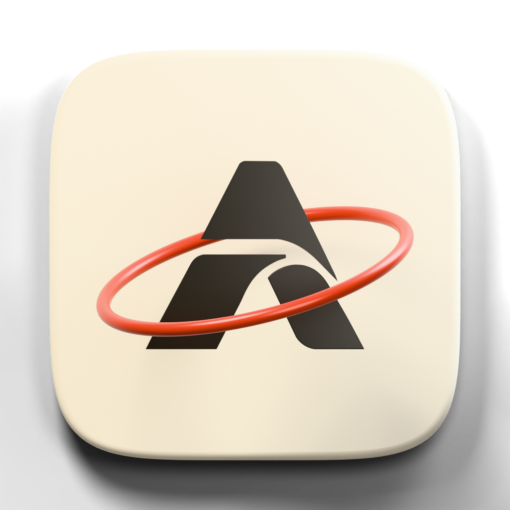

# AxioSozo browser — handoff 1

The [26 September continuation](docs/PROVIDER_ENGINE_PROGRESS.md) adds direct
provider conversation wiring, per-tab Chromium web-mode code, lazy process startup
and simpler Zen defaults. Approved live checks stopped before model requests:
Codex needs login for its separate profile and Claude authentication is unavailable
under confinement. The CEF Keychain runtime gate also remains unresolved; this is
a development prototype.

**PARTIAL_ENGINE_BLOCKED; not READY.** The custom Zen/Firefox app builds and runs
on macOS Apple Silicon. Its experimental CEF surface has rendered real Chromium
frames and accepted input in the same window in earlier fixture runs. The current
runtime is blocked on a shared Keychain request; general browsing, safety and
accessibility flows still need validation.
See [current status](docs/SETUP_STATUS.md) for the exact scope and remaining gates.
The raw development evidence contains machine-specific logs and stays local;
[the evidence note](docs/evidence/README.md) explains this public-source boundary.

From this project folder, the development contract is:

```sh
./dev doctor
./dev setup
./dev
```

`doctor` is read-only and currently exits nonzero because the browser is not READY.
`setup` checks pinned sources, bootstraps only audited toolchains, and builds the
coordinator, native CEF host and custom Zen app. The first Zen/Firefox build is a
large native build, not a Vite server. `./dev` reuses matching build stamps and
starts the real custom app with an owned development profile. If source changed,
run `./dev setup` before starting it again.

Our source, patches, contracts and documentation live in this project folder on
T9. This project currently assumes Wout's macOS/T9 development layout; the
setup scripts need adaptation for another machine. This folder is exFAT, so the
large pinned upstream working checkout, native build, caches, dependencies,
synthetic profiles and temporary files use the
project-only APFS image mounted at `/Volumes/AxioSozoBuild`, physically backed by
`/Volumes/T9/AxioSozoBuild.sparsebundle`.
Before external builds, the project calls `mount-dev-storage`, then the required
`dev-external` wrapper and `scripts/storage.py exec --` to override its temporary
and cache paths into the project image. The shared DevStorage image is not moved,
resized, detached or cleaned. Two build jobs are used on this 16 GiB Mac.
The pinned Node 22.22.3, Rust 1.95.0, Python 3.11.16 and GNU tar 1.35 tools pass
the current component doctor. The lockfile records exact upstream revisions and
archive hashes; network-enabled setup fetches only verified upstream URLs.

| Command | Behavior |
| --- | --- |
| `./dev doctor` | Read-only platform, storage, toolchain, build and provider metadata |
| `./dev setup` | Controlled pinned source/bootstrap/native builds; first build can take substantial time |
| `./dev` | Start verified custom Zen and owned services with its development profile |
| `./dev --profile second` | Use an explicitly separate development profile |
| `./dev check` | Rust formatting/clippy, JS/provider, Zen source and native CEF checks |
| `./dev test` | Deterministic Rust, IPC/lifecycle, provider/Jev, fixture and real CEF stream tests |
| `./dev smoke` | Owned Zen fixture/TLS inspection session; GUI assertions require observing that run |
| `./dev engine-probe` | Fresh E0, then owned Zen fixture session with explicit experimental switch |
| `./dev web-probe` | Fresh E0, then owned HTTP/TLS fixture session using experimental Chromium web mode |
| `./dev provider-test codex --authorized` | Approved fixed diagnostic only; its dedicated profile currently requires login |
| `./dev provider-test claude-code --authorized` | Approved fixed diagnostic only; authentication is unavailable under confinement |
| `./dev provider-test antigravity --authorized` | Reports unsupported startup isolation; no live request |
| `./dev jev-test` | Optional synthetic decision diagnostic; key and explicit authorization required |

In the 23 September baseline, CEF154's signed native host passed E0 with 26 real OSR frames, input, 2× Retina
resize, local GET navigation/back and clean shutdown. The authenticated AXCF pipe
passed a separate eight-frame native test with stale-target rejection and exact
generation changes on a browser-cache return. A separate manual macOS GUI probe
observed real CEF frames, typing, page2/back and an explicit return to Gecko in
the Zen window. The latest live macOS GUI probe kept Chromium active through
typing and a 5K fullscreen transition, then
returned to Gecko and exited without owned CEF profiles. The probe driver still
exits20 because it has no automated GUI assertions; no integrated screenshot file
was saved. The local CEF result binds the native source hashes, build stamp and
process-cleanup evidence.

Provider discovery reads metadata only. The current Codex 0.157.1 and Claude Code
2.1.283 routes use reviewed official-client protocols with isolated customization
and bounded streaming conversations. Live authentication and model responses have
not been verified. Antigravity remains unavailable because its startup/tool isolation
has not been established. No client, login UI, MCP server, hook,
paid model or Jev network request is started by discovery, setup or deterministic
tests. Provider fixtures are visibly `TEST_FIXTURE`; they do not certify live auth.
Jev is optional, and a Keychain failure never falls back to plaintext storage.
See [provider boundaries](docs/PROVIDERS.md).

Daily source changes use a controlled `Ctrl+C`, `./dev setup`, `./dev` rebuild and
restart. Stamps reject stale native source; no C++ hot reload is promised. A
second start of the same development profile respects its owner lock rather than
opening the profile twice. Shutdown targets only this session's process groups;
there is no broad `pkill`, default-browser change or access to personal profiles.

If setup stops, rerun it after checking [status](docs/SETUP_STATUS.md). Downloads
are checksum verified; existing checkouts and profiles are preserved. Do not reset
an unknown source checkout or delete another project's cache to recover space.
Inspect the named component evidence before changing an upstream pin. Security
updates are deliberate: review upstream advisories, update the lock and patch
manifest, rebuild, rerun checks and GUI probes, then publish only with separate
authorization. This local fork does not follow Zen's ordinary automatic update
channel.

The [architecture](docs/adr/001-architecture.md),
[dual-engine decision](docs/adr/002-dual-engine.md),
[upstream/licence notes](docs/UPSTREAMS.md) and
[handoff 2 entrypoints](docs/IMPLEMENTATION_HANDOFF.md) define the remaining work.
The current first-experience slice is tracked in
[implementation status](docs/IMPLEMENTATION_STATUS.md),
[UX flows](docs/UX_FLOWS.md), [capabilities](docs/CAPABILITY_MATRIX.md) and the
[test walkthrough](docs/TEST_WALKTHROUGH.md).
The original AxioSozo source is licensed under [MPL-2.0](LICENSE). Vendored
components and upstream patches retain their respective notices; see
[third-party notices](THIRD_PARTY_NOTICES.md).
Chromium's IME, downloads, permissions, certificate dialogs,
accessibility and crash recovery remain explicit release gates. Fullscreen fixture
rendering now works with a bounded 1.5× CEF render scale on this 5K display;
general-site fullscreen and safety UI are not certified.
