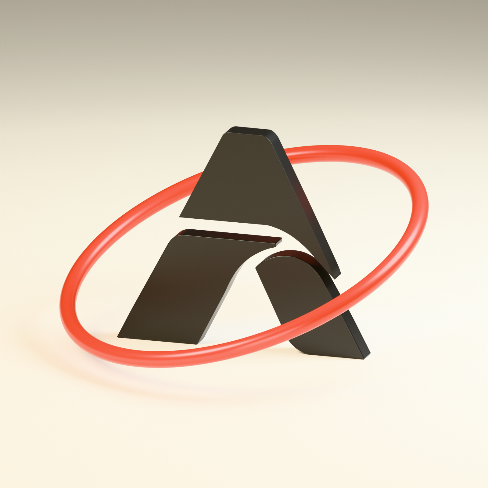

# AxioSozo browser — 3D logo v1

> **Replaced.** The browser now uses [app icon v2](../browser-logo-v2/README.md).
> Running this folder's `build_icons.py` would put the v1 icons back.



This is the browser version of the [AxioSozo 3D symbol](../axiosozo-symbol-v1/README.md).
The three-part A is loaded unchanged from the symbol's Blender file. A vermilion orbit
ring goes around it, like a ring around a planet: the near side passes in front of the
legs and the far side behind the crown. The ring suggests a world, which is what a
browser opens. The app icon puts this mark on a cream tile sized to the macOS icon grid.

Colours are AxioSozo brand colours: ink `#1C1A16` (symbol, unchanged), vermilion
`#C73E1D` (orbit) and cream `#F0E9D7` (tile). Renders use Blender's
*Khronos PBR Neutral* view transform so these colours are not shifted.

## Files

- `axiosozo-browser-logo-v1.blend` — editable scene. `01 | MARK` holds the symbol
  (with its live Solidify, Bevel and Weighted Normal modifiers) and `04 | Orbit`.
  `02 | ICON` holds the app tile. `03 | STUDIO` holds lights, cameras, the floor and a
  shadow catcher.
- `axiosozo-browser-mark-v1.glb` — mark only (symbol + orbit), modifiers applied, Y-up.
- `axiosozo-browser-mark-v1-preview.png` — three-quarter studio render.
- `axiosozo-browser-mark-v1-front.png` — front orthographic render on a transparent
  background, for light backgrounds.
- `axiosozo-browser-icon-v1-1024.png` — macOS app icon: an 824 px squircle tile on a
  1024 px transparent canvas.
- `create_browser_logo.py` — Blender script that rebuilds everything above.
- `build_icons.py` — makes the browser icon set in `apps/browser/branding/` from the
  1024 px icon.
- `validation.json` — dimensions, orbit clearance and mesh checks.

## Geometry

The mark is 232 mm wide and 138 mm tall. The symbol is the borrowed 160 × 138 × 14 mm
A. The orbit is a 114 mm radius ring with a 5.2 mm tube. It is tilted 17° toward the
viewer and rolled −14° so it rises to the right, like the crown's cut. The build script
checks that the orbit stays at least 2 mm from the symbol (actual: 32 mm) and does not
touch the tile. The tile is 300 mm square and 24 mm deep, with a superellipse outline
(exponent 5). All solids are manifold with positive volume.

## Browser icon set

`scripts/zen.py` copies `apps/browser/branding/` into the generated `axiosozo-dev`
Firefox branding folder during `./dev setup`:

| File | Use |
| --- | --- |
| `firefox.icns` | macOS app icon (`CFBundleIconFile`; the app sets no `CFBundleIconName`, so `Assets.car` is not used) |
| `default16.png` … `default256.png` | Window icons and `chrome://branding/content/icon*.png` |
| `content/about-logo.png`, `@2x`, `.svg` | About dialog and other branding logos |
| `content/about-wordmark.svg` | About dialog wordmark, `AXIOSOZO` as in the v3 identity |

The same step changes the About dialog background from Nightly purple to brand ink.
At 16 px the orbit is just a hint of colour; the mark reads clearly from 32 px up.

## Rebuild

```sh
/Users/wout/.local/bin/mount-dev-storage
python3 scripts/storage.py setup
/Users/wout/.local/bin/dev-external python3 scripts/storage.py exec -- \
  /Applications/Blender.app/Contents/MacOS/Blender --background --factory-startup \
  --python assets/brand/browser-logo-v1/create_browser_logo.py
python3 assets/brand/browser-logo-v1/build_icons.py
./dev setup   # packages the new icons into AxioSozo Dev.app
```

Rendering takes about three minutes on the Metal GPU.
