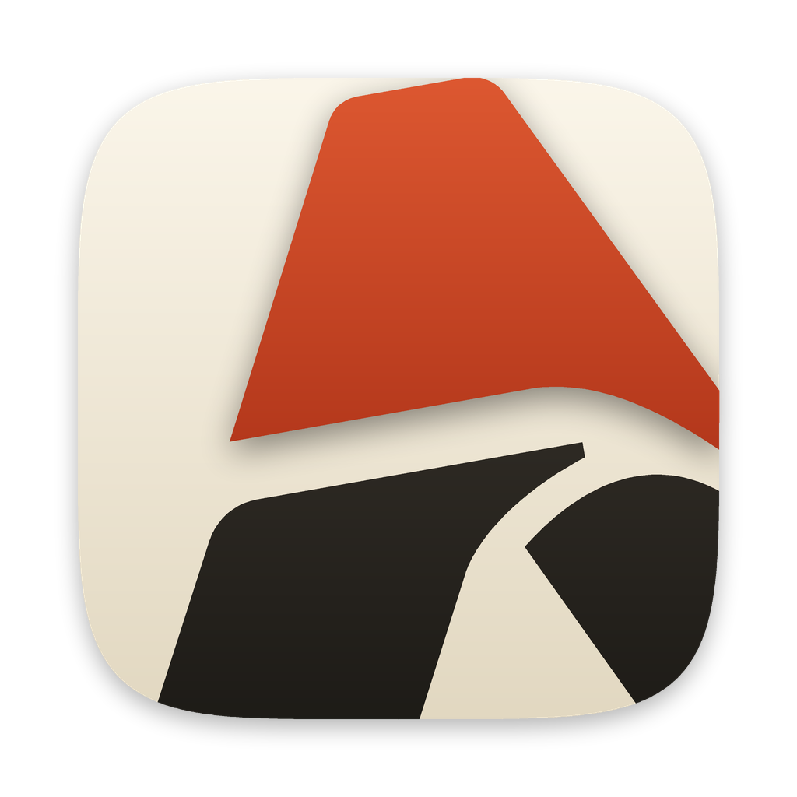

# AxioSozo browser — app icon v2 ("Off-centre")



This is the browser app icon. It replaces [v1](../browser-logo-v1/README.md), the A
with a vermilion orbit. It is the *Off-centre* idea from the
[v2 sketches](../browser-logo-v2-sketches/README.md), round 3.

The AxioSozo A (unchanged geometry, redrawn as vectors) is enlarged 1.3×, turned
10° anticlockwise and pushed right and down, so it runs off the tile. The crown is
vermilion and is the focal point; the legs are ink on a cream tile. Light comes from
above (each colour is a vertical gradient) and the crown casts a soft shadow on the
legs.

Colours are AxioSozo brand colours: vermilion `#C73E1D`, ink `#1C1A16` and cream
`#F0E9D7`, each lightened at the top and darkened at the bottom.

## Files

- `axiosozo-browser-icon-v2-1024.png` — macOS app icon: an 824 px squircle tile
  (superellipse exponent 5) on a 1024 px transparent canvas, with a soft shadow
  that fades out inside the canvas margin.
- `axiosozo-browser-icon-v2.svg` — the same artwork as vectors, without the outer
  shadow.
- `create_icon.py` — renders both files, using the geometry and renderer in
  `../browser-logo-v2-sketches`.
- `build_icons.py` — makes the browser icon set in `apps/browser/branding/` from the
  1024 px icon. It is v1's script with only the source file changed; the table of
  outputs is in the [v1 README](../browser-logo-v1/README.md#browser-icon-set).

At 16 px the icon reads as a red peak over dark shapes, not as a clear A. A
separate small-size glyph for window and tab icons would fix that; there is none yet.

## Rebuild

```sh
/Users/wout/.local/bin/mount-dev-storage
/Users/wout/.local/bin/dev-external python3 scripts/storage.py exec -- \
  python3 assets/brand/browser-logo-v2/create_icon.py
/Users/wout/.local/bin/dev-external python3 scripts/storage.py exec -- \
  python3 assets/brand/browser-logo-v2/build_icons.py
./dev setup   # packages the new icons into AxioSozo Dev.app
```
